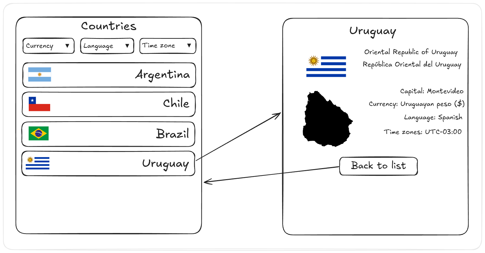

# Parcial 2 2025sem2 (matutino)

Segundo parcial del curso de Desarrollo Web y Mobile.

## Inicialización

Crear un _fork_ privado de este repositorio. Clonar el _fork_ y ejecutar `npm i` en la carpeta `/web`. La versión de desarrollo de la app se levanta haciendo `npm start` en la carpeta `/web`. La plantilla del ejercicio provee un ruteador básico y una página de inicio mínima. La carpeta `/web/data` tiene el _mock_ del _backend_ de la app, y **no** es de interés para realizar el ejercicio.

## Aplicación

El ejercicio se trata de implementar una aplicación _web_ para búsqueda de información de países. Un croquis de la interfaz de usuario pueden verse en la carpeta `/web/specs/design.png`.

### Ruta 1: Inicio `/`

La página de inicio debe mostrar una lista de países, donde cada ítem debe:

+ Mostrar la bandera del país.

+ Mostrar el nombre del país.

+ Ir a la ruta del país cuando se cliquea.

En el encabezado de la página se deben mostrar tres filtros en forma de tres `<select />` de HTML. Estos se deben rellenar con:

+ Monedas (poblado con el resultado de `GET /api/currencies`).

+ Lenguajes (poblado con el resultado de `GET /api/languages`).

+ Zonas horarias (poblado con el resultado de `GET /api/timezones`).

La lista de países se obtiene con `GET /api/countries`, usando valores en el _query string_ para aplicar los filtros. Éstos son:

- `currency` para moneda, e.g. `GET /api/countries?currency=EUR`.

- `language` para lenguaje, e.g. `GET /api/countries?language=fra`.

- `timezone` para la zona horaria, e.g. `GET /api/countries?timezone=UTC%2B01:00`.

Como es de esperarse, se pueden usar más de un filtro a la vez.

### Ruta 2: Página de país `/country/:cca3`

La página de país muestra información para un país en particular. Esto incluye:

- Nombres del país, en inglés y lenguaje oficial.

- Ciudad capital.

- Monedas oficiales.

- Lenguajes oficiales.

- Zonas horarias cubiertas.

Al final de la información se debe disponer de un botón para volver a la vista de inicio.

## Útiles

El código incluído desde el inicio tiene una plantilla de proyecto de aplicación web usando Vite, React y React Router. El módulo `/web/components/App.jsx` tiene una implementación de ejemplo del ruteo de la app. El módulo de CSS `/web/index.css` está pensado para contener los estilos que el estudiante pueda quere definir. Esto es opcional, y las tipografías y colores por defecto del navegador son suficientes para completar el ejercicio con éxito.

El módulo `/web/components/ApiRef.jsx` atiende a la ruta `/ref/api` de la aplicación. Muestra ejemplos de uso de la API que el servidor de desarrollo de Vite levanta. Esta ruta no tiene por qué incluirse en la entrega.

_Fin_

