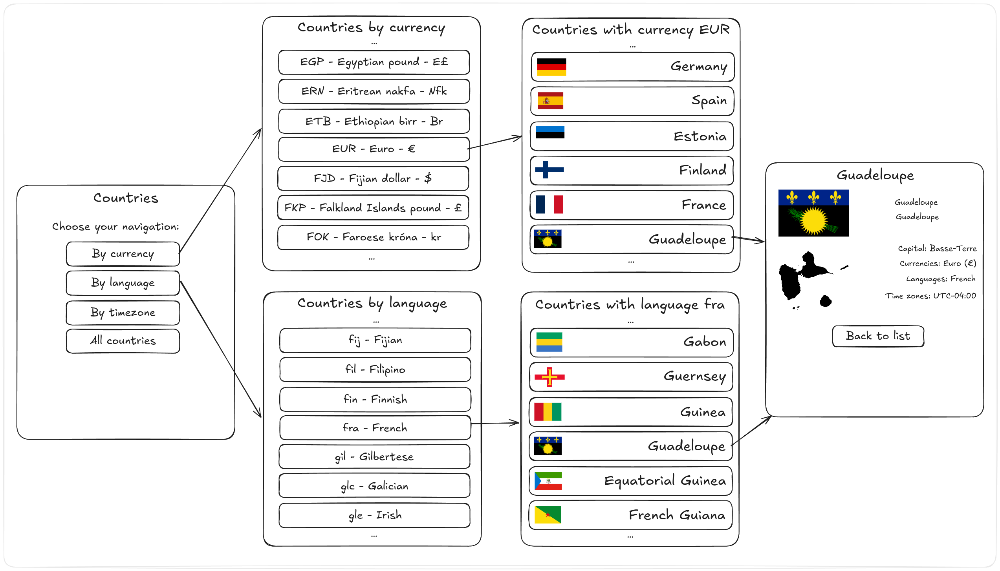

# Parcial 2 2025sem2 (vespertino)

Segundo parcial del curso de Desarrollo Web y Mobile.

## Inicialización

Crear un _fork_ privado de este repositorio. Clonar el _fork_ y ejecutar `npm i` en la carpeta `/web`. La versión de desarrollo de la app se levanta haciendo `npm start` en la carpeta `/web`. La plantilla del ejercicio provee un ruteador básico y una página de inicio mínima. La carpeta `/web/data` tiene el _mock_ del _backend_ de la app, y **no** es de interés para realizar el ejercicio.

## Aplicación

El ejercicio se trata de implementar una aplicación _web_ para búsqueda de información de países. Un croquis de la interfaz de usuario pueden verse en la carpeta `/web/specs/design.png`.

### Ruta 1: Inicio `/`

La página de inicio debe mostrar cuatro enlaces a cuatro posibles vistas. Las tres primeras permiten filtrar países por _moneda_ (ruta 4), _lenguage_ (ruta 6) y _zona horaria_ (ruta 8). La cuarta simplemente muestra todos los países sin filtro (ruta 2).

### Ruta 2: Todos los países `/countries`

Todas las vistas de países son análogas. Se muestra un título y una lista de países. Cada ítem de la lista muestra la bandera y el nombre del país, e incluye un enlace a la vista con la información del país (ruta 3).

### Ruta 3: Detalle de país `/countries/:cca3`

La página de país muestra información para un país en particular. Esto incluye: nombres del país (en inglés y en el lenguaje oficial), ciudad capital, monedas oficiales, lenguajes oficiales y zonas horarias cubiertas.

Al final de la información se debe disponer de un botón para volver a la vista de inicio.

### Ruta 4: Filtro por moneda `/currencies`

La vista de filtro por moneda muestra la lista de todas las monedas en la base de datos. Cada una está dada por su código, nombre y símbolo, además de incluir un enlace a la vista de países filtrados por esa moneda (ruta 5).

### Ruta 5: Países filtrados por moneda `/currencies/:currencyCode`

La vista de países filtrados por una moneda dada es análoga a la vista de países de la ruta 2. Simplemente cambia el título y el origen de los datos.

### Ruta 6: Filtro por lenguaje `/languages`

La vista de filtro por lenguaje muestra la lista de todos los lenguajes en la base de datos. Cada uno está dado por su código y su nombre, además de incluir un enlace a la vista de países filtrados por ese lenguaje (ruta 7).

### Ruta 7: Países filtrados por lenguaje `/languages/:languageCode`

La vista de países filtrados por un lenguaje dado es análoga a la vista de países de la ruta 2. Simplemente cambia el título y el origen de los datos.

### Ruta 8: Filtro por zona horaria `/timezones`

La vista de filtro por zona horaria muestra la lista de todas las zonas horarias en la base de datos. Cada una está dada por su código (e.g. `UTC-03.:00`), además de incluir un enlace a la vista de países filtrados por esa zona horaria (ruta 9).

### Ruta 9: Países filtrados por zona horaria `/timezones/:timezone`

La vista de países filtrados por una zona horaria dada es análoga a la vista de países de la ruta 2. Simplemente cambia el título y el origen de los datos.

## Útiles

El código incluído desde el inicio tiene una plantilla de proyecto de aplicación web usando Vite, React y React Router. El módulo `/web/components/App.jsx` tiene una implementación de ejemplo del ruteo de la app. El módulo de CSS `/web/index.css` está pensado para contener los estilos que el estudiante quiera definir. Esto es opcional, y las tipografías y colores por defecto del navegador son suficientes para completar el ejercicio con éxito.

El módulo `/web/components/ApiRef.jsx` atiende a la ruta `/ref/api` de la aplicación. Muestra ejemplos de uso de la API que el servidor de desarrollo de Vite levanta. Esta ruta no tiene por qué incluirse en la entrega.

El planteo del ejercicio tiene muchas vistas muy similares entre sí. Debería ser posible reutilizar bastante código de una a la otra.

### Colección de Postman

Hay una colección de Postman disponible en el archivo `Countries API.postman_collection.json` que documenta todos los endpoints de la API del proyecto.

**Cómo usar la colección:**
1. Abrir Postman
2. Hacer clic en **Import** (Importar)
3. Seleccionar el archivo `Countries API.postman_collection.json`
4. La colección se importará con todas las peticiones listas para usar
5. Asegurarse de que el servidor de desarrollo esté corriendo (`npm start` en `/web`)
6. La variable `{{base_url}}` está configurada por defecto en `http://localhost:5173`

La colección incluye ejemplos de todos los endpoints disponibles, incluyendo filtros por moneda, lenguaje y zona horaria.

_Fin_

