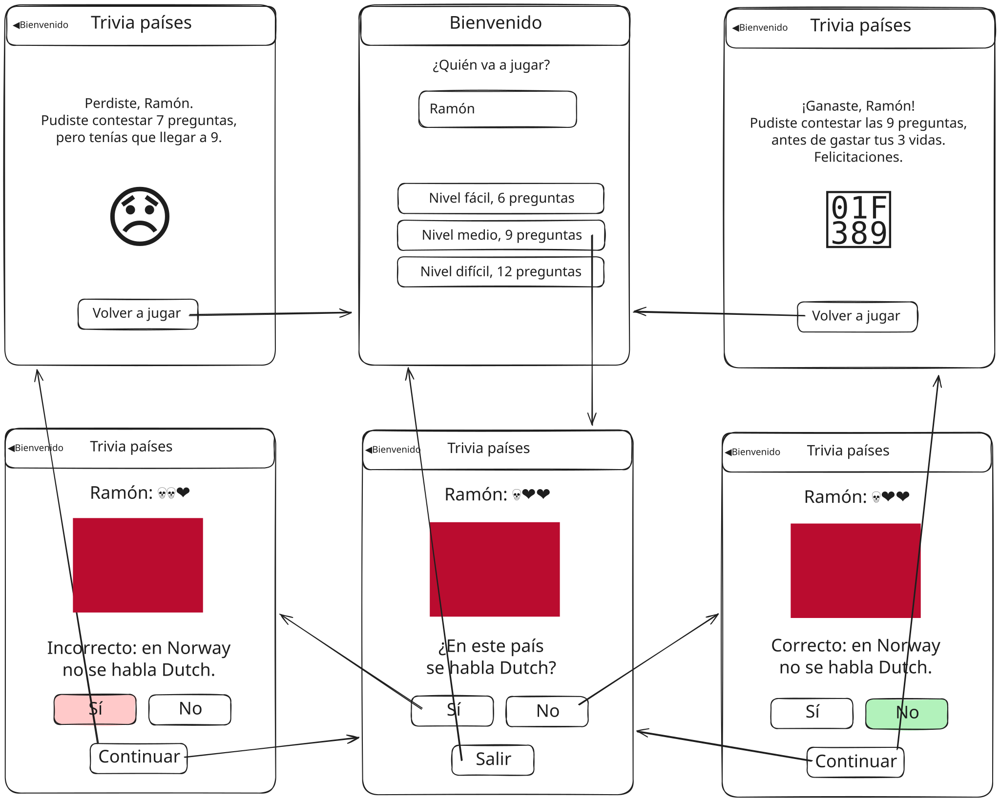

# Parcial 3 2025sem2

Tercer parcial del curso de Desarrollo Web y Mobile.

## Inicialización

Crear un _fork_ privado de este repositorio. Clonar el _fork_ y ejecutar `npm i` en la raíz. La versión de desarrollo de la app se levanta haciendo `npm start` en la raíz. La plantilla del ejercicio provee un ruteador básico y dos vistas de ejemplo. Las carpetas `/app/api` y `/app/static` tienen datos y archivos para el _mock_ del _backend_ de la app, y **no** son de interés para realizar el ejercicio.

## Trivia de países

El ejercicio se trata de implementar una aplicación _mobile_ con React Native y Expo, para una trivia de países. Un croquis de interfaz de usuario pueden verse en la carpeta `/specs/design.svg`.

## Navegación

En proyecto contiene una navegación con Expo Router. Aunque la primera ruta sea index, no queremos que en el header de navegación diga header, si no que queremos que diga "Bienvenido".
Se debe agregar otra pantalla al stack. La pantalla de la trivia.
Esta pantalla debe tener como titulo en el header de navegación "Trivia de Países" con la posibilidad de ir a la pantalla anterior en la esquina izquierda. (Back Button)



Se deben tener tres vistas:

### Vista 1: Bienvenida

En la ruta `/` se debe mostrar una bienvenida al usuario. Aquí se pide el nombre del usuario jugador, que debe mostrarse en la otra vista.

Debajo del nombre del jugador se muestran tres botones para iniciar el juego, correspondiendo a los tres niveles de dificultad: _Fácil_, _Medio_ y _Difícil_. Todos estos botones deben ir a la siguiente pantalla de Juego, pero le dan al jugador diferentes cantidades de preguntas que se deben responder para ganar. _Fácil_ pide 6 preguntas, _Medio_ pide 9 y _Difícil_ pide 12. El usuario siempre comienza la partida con 3 vidas.

### Vista 2: Juego

En la ruta `/game` se debe mostrar una bandera o mapa de un país aleatorio. La probabilidad de mostrar la banderas o el mapa debe ser del 50%.

Se le pregunta al usuario si en el país correspondiente al mapa o bandera se habla un determinado lenguaje. Con una probabilidad del 50% se debe elegir si usar uno de los lenguajes del país (elegido al azar) o un lenguaje de otro país tomado aleatoriamente. Se muestran dos botones para responder _Sí_ o _No_. Debajo se muestra un tercer botón de _Salir_ para volver a la vista de bienvenida.

En la parte superior de la pantalla se muestra el nombre el usuario y la cantidad de vidas que le quedan. Se usan emojis de ❤️ para las vidas que quedan, y emojis de 💀 para las vidas perdidas.

Al presionar uno de los botones:

- Se le debe indicar al usuario si contestó bien o mal.

- Se ajusta el puntaje.

- Se cambia el botón de _Salir_ por un botón de _Continuar_ que pasa a la siguiente pregunta (si quedan preguntas por responder y vidas) o a la vista de Fin (si no quedan preguntas o no quedan vidas).

### Vista 3: Fin

Al terminarse las vidas o las preguntas, la vista de Juego muestra la pantalla de Fin. Si se terminaron las vidas antes de las preguntas, se pierde el juego. En este caso se debe indicar la cantidad de preguntas respondidas y las que se debían responder.

Si se terminaron las preguntas antes de las vidas, se gana el juego y se debe felicitar al usuario. En este caso se debe indicar la cantidad de preguntas respondidas.

El botón de _Salir_ se cambia por _Volver a jugar_, pero sigue llevando a la pantalla de bienvenida.

## API e imágenes

La lista de todos los códigos de país disponibles se puede acceder haciendo:

```
GET /api/countries
200 ["ABW", "AFG", ...]
```

Se pueden obtener países aleatorios de la siguiente forma:

```
GET /api/countries/random?n=2
200 ["URY", "ARG"]
```

dónde `n` es la cantidad de países deseada.

Las imágenes de las banderas y mapas de los países de pueden acceder en `/static/flags/cca3.svg` y `/static/maps/cca3.svg` respectivamente, dónde `cca3` es el código de 3 letras del país (e.g. `URY`). Están disponibles en formatos SVG y PNG.

_Fin_
