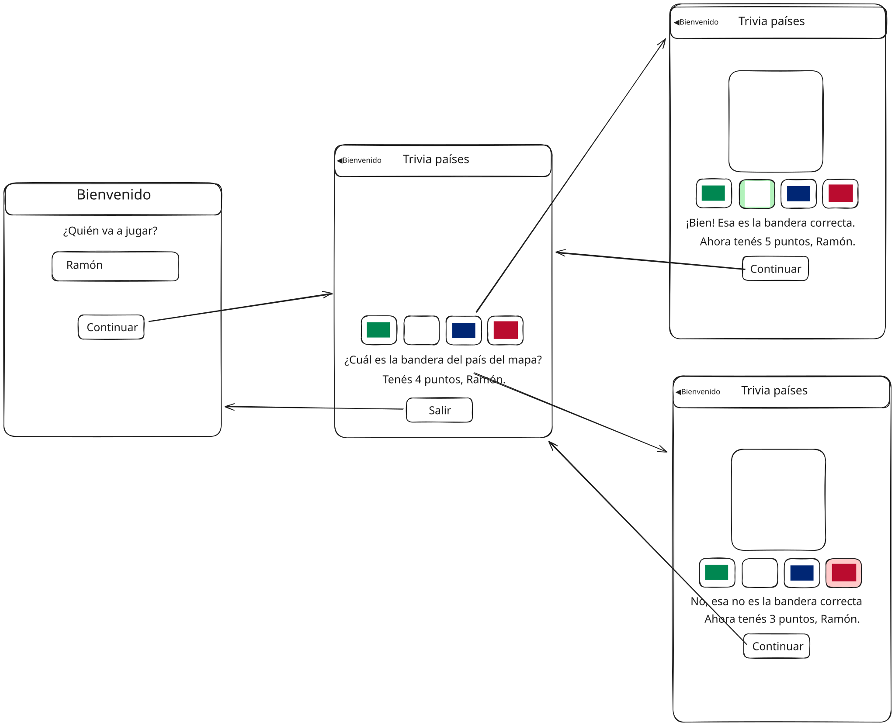

# Simulacro parcial 3 2025sem2

Simulacro del tercer parcial del curso de Desarrollo Web y Mobile.

## Inicialización

Crear un _fork_ privado de este repositorio. Clonar el _fork_ y ejecutar `npm i` en la raíz. La versión de desarrollo de la app se levanta haciendo `npm start` en la raíz. La plantilla del ejercicio provee un ruteador básico y dos vistas de ejemplo. Las carpetas `/app/api` y `/app/static` tienen datos y archivos para el _mock_ del _backend_ de la app, y **no** son de interés para realizar el ejercicio.

## Trivia de países

El ejercicio se trata de implementar una aplicación _mobile_ con React Native y Expo, para una trivia de países. Un croquis de interfaz de usuario pueden verse en la carpeta `/specs/design.svg`.

## Navegación

En proyecto contiene una navegación con Expo Router. Aunque la primera ruta sea index, no queremos que en el header de navegación diga header, si no que queremos que diga "Bienvenido".
Se debe agregar otra pantalla al stack. La pantalla de la trivia.
Esta pantalla debe tener como titulo en el header de navegación "Trivia de Países" con la posibilidad de ir a la pantalla anterior en la esquina izquierda. (Back Button)



Se deben tener dos vistas:

### Vista 1: Bienvenida

En la ruta `/` se debe mostrar una bienvenida al usuario.
Aquí se pide el nombre del usuario jugador, que debe mostrarse en la otra vista.
Desde el botón continuar se debe ir a la siguiente pantalla.

### Vista 2: Juego

En la ruta `/game` se debe mostrar un mapa de un país aleatorio. Debajo de dicho mapa, se deben mostrar cuatro botones, cada uno con una bandera. Una de esas banderas debe ser la del país del mapa mostrado arriba. Las otras 3 deben ser banderas de otros 3 países elegidos al azar. En cuál posición está la bandera correcta también debe ser aleatoria.

Debajo de las banderas se debe mostrar el puntaje del usuario, dado por la resta de respuestas correctas menos las respuestas equivocadas. Al presionar uno de los botones con las banderas:

- Se le debe indicar al usuario si contestó bien o mal.

- Se ajusta el puntaje.

- Se muestra un botón debajo de las banderas para refrescar la página con otro desafío.

## API e imágenes

La lista de todos los códigos de país disponibles se puede acceder haciendo:

```
GET /api/countries
200 ["ABW", "AFG", ...]
```

Se pueden obtener países aleatorios de la siguiente forma:

```
GET /api/countries/random?n=2
200 ["URY", "ARG"]
```

dónde `n` es la cantidad de países deseada.

Las imágenes de las banderas y mapas de los países de pueden acceder en `/static/flags/cca3.svg` y `/static/maps/cca3.svg` respectivamente, dónde `cca3` es el código de 3 letras del país (e.g. `URY`). Están disponibles en formatos SVG y PNG.

_Fin_
