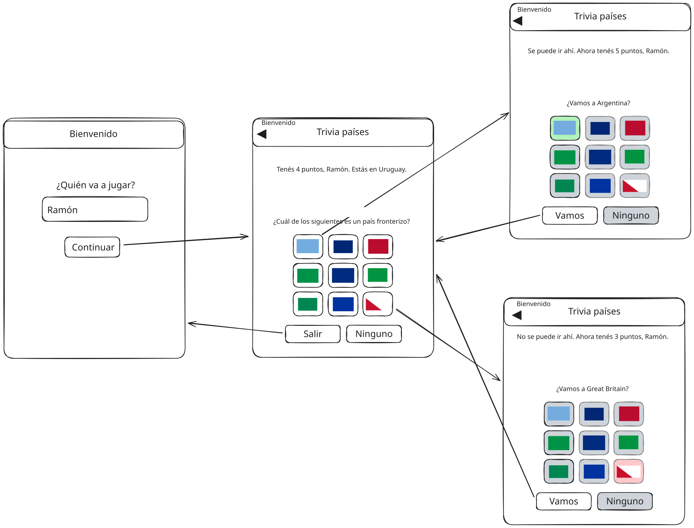

# Simulacro parcial 3 2025sem2

Simulacro del tercer parcial del curso de Desarrollo Web y Mobile.

## Inicialización

Crear un _fork_ privado de este repositorio. Clonar el _fork_ y ejecutar `npm i` en la raíz. La versión de desarrollo de la app se levanta haciendo `npm start` en la raíz. La plantilla del ejercicio provee un ruteador básico y dos vistas de ejemplo. Las carpetas `/app/api` y `/app/static` tienen datos y archivos para el _mock_ del _backend_ de la app, y **no** son de interés para realizar el ejercicio.

## Trivia de países

El ejercicio se trata de implementar una aplicación _mobile_ con React Native y Expo, para una trivia de países. Un croquis de interfaz de usuario pueden verse en la carpeta `/specs/design.svg`.



## Navegación

En proyecto contiene una navegación con Expo Router. Aunque la primera ruta sea index, no queremos que en el header de navegación diga header, si no que queremos que diga "Bienvenido".
Se debe agregar otra pantalla al stack. La pantalla de la trivia.
Esta pantalla debe tener como titulo en el header de navegación "Trivia de Países" con la posibilidad de ir a la pantalla anterior en la esquina izquierda. (Back Button)

Se deben tener dos vistas:

### Vista 1: Bienvenida

En la ruta `/` se debe mostrar una bienvenida al usuario. Aquí se pide el nombre del usuario jugador, que debe mostrarse en la otra vista.
Desde el botón continuar se debe ir a la siguiente pantalla.

### Vista 2: Juego

En la ruta `/game` se debe mostrar la bandera del país actual, inicialmente elegido a azar. Debajo de dicha bandera, se deben mostrar nueve botones, cada uno con una bandera. Algunas de esas banderas debe ser la de los países limítrofes al país actual. Las otras deben ser banderas de otros países elegidos al azar. Las posiciones de las banderas de un y otro tipo también deben ser aleatorias.

Debajo de las banderas se muestran dos botones:

- _Salir_, que vuelve a la vista de bienvenida.

- _Ninguno_, que aplica cuando el país actual no tiene fronteras con otro país.

En la vista se le muestra al usuario su puntaje actual y su nombre. El usuario debe presionar algún botón de un país limítrofe (o el botón _Ninguno_ de no haber ninguno). Al hacerlo se debe:

- Indicarle al usuario si contestó bien o mal. El botón presionado debe colorearse con verde si se contestó bien, y rojo si contestó mal. Los otros botones deben colorearse con gris.

- Actualizar el puntaje actual del usuario y mostrárselo. Respuestas correctas suman 1 punto, mientras que las incorrectas restan 1 punto.

- Proponerle al usuario ir al país elegido, independientemente de que sea fronterizo o no.

- El botón de _Salir_ cambia por el botón de _Vamos_. Todos los demás botones se deben desactivar. El botón _Vamos_ cambia el país actual y vuelve a desafiar al usuario.

## API e imágenes

La lista de todos los códigos de país disponibles se puede acceder haciendo:

```
GET /api/countries
200 ["ABW", "AFG", ...]
```

Se pueden obtener varios datos de un país en particular (incluyendo sus países fronterizos) haciendo:

```
GET /api/countries/URY
200 {
  "name": {
    "common": "Uruguay",
    ...
  },
  "borders": ["ARG", "BRA"],
  ...
}
```

Se pueden obtener países aleatorios de la siguiente forma:

```
GET /api/countries/random?n=2
200 ["URY", "ARG"]
```

dónde `n` es la cantidad de países deseada.

Las imágenes de las banderas de los países de pueden acceder en `/static/flags/cca3.svg` respectivamente, dónde `cca3` es el código de 3 letras del país (e.g. `URY`). Están disponibles en formatos SVG y PNG.

_Fin_