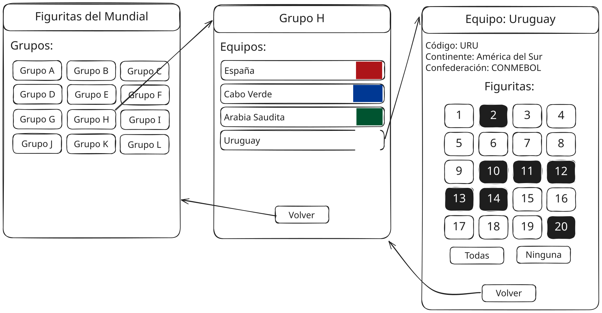

# Prueba 3 2026sem1

Tercera prueba del curso de Desarrollo Web y Mobile.

## Inicialización

Crear un _fork_ privado de este repositorio. Clonar el _fork_ y ejecutar `npm i` en la raíz. La versión de desarrollo de la app se levanta haciendo `npm start` en la raíz. La plantilla del ejercicio provee un ruteador básico y dos vistas de ejemplo. Las carpetas `/app/api` y `/app/static` tienen datos y archivos para el _mock_ del _backend_ de la app, y **no** son de interés para realizar el ejercicio.

## Trivia de países

El ejercicio se trata de implementar una aplicación _mobile_ con React Native y Expo. La app es para llevar un control de un album de figuritas del mundial de fútbol. Un croquis de interfaz de usuario pueden verse en la carpeta `/specs/design.svg`.



## Navegación

En proyecto contiene una navegación con Expo Router. Aunque la primera ruta sea index, no queremos que en el header de navegación diga header, si no que queremos que diga "Bienvenido". Se debe agregar al stack la pantalla de la app. Esta pantalla debe tener como titulo en el header de navegación "Figuritas del Mundial" con la posibilidad de ir a la pantalla anterior en la esquina izquierda.

Se deben tener las siguientes vistas.

### Ruta 1: Bienvenida

En la ruta `/` se debe mostrar una bienvenida al usuario. Aquí se muestran 12 botones para cada grupo del mundial de fútbol. Cada uno de ellos debe dirigir a la vista del grupo correspondiente.

### Ruta 2: Grupo

En la ruta `/groups/:letter` se deben mostrar cuatro botones: uno para cada equipo que integra el grupo dado. Los botones deben tener el nombre del equipo y su bandera. Cada botón al presionarse debe navegar hacia la vista del equipo. Además se muestra un botón de _Volver_ para navegar de nuevo a la vista de grupos.

### Ruta 3: Equipo

En la ruta `/teams/:code` se el estado del album para el equipo. En el encabezado de la vista se muestra el nombre del equipo, su grupo, continente, confederación y bandera.

El cuerpo de la vista se compone de 20 botones, cada uno representando el estado de cada figurita en el album. El usuario debe poder presionar el botón para marcar o desmarcar la figurita como pegada. Estos cambios deben reflejarse en la base de datos invocando a la API con un PATCH. 

Se proveen dos botones auxiliares:

- _Todas_: marca todas las figuritas.

- _Ninguna_: desmarca todas las figuritas.

Al pie de la vista se pone un botón de _Volver_ para navegar hacia la vista de grupo.

## API e imágenes

La base de código provista ya tiene una implementación de desarrollo de la API con la cual debe interactuar la aplicación. Es suficiente con ejecutar `npm start` para levantar tanto el _frontend_ con Expo como el _backend_. No es necesario levantar un servidor aparte.

La lista de todos los grupos disponibles se puede acceder haciendo:

```
GET /api/groups
200 ["A", "B", ...]
```

Se pueden obtener los equipos de un grupo en particular haciendo:

```
GET /api/groups/H
200 [
  {
    "code": "URU",
    "name": "Uruguay"
    "confed": "CONMEBOL",
    ...
  },
  ...
]
```

Se puede obtener la información de un equipo en particular haciendo:

```
GET /api/teams/URU
200 {
  "code": "URU",
  "name": "Uruguay"
  "confed": "CONMEBOL",
  "stickers": [true, true, true, ...],
  ...
}
```

Se puede modificar únicamente la lista de figuritas (o _stickers_) de un equipo haciendo:

```
PATCH /api/teams/URU
{
  "stickers": []
}
200 {
  "code": "URU",
  "name": "Uruguay"
  "stickers": [true, true, ...],
  ...
}
```

Las imágenes de las banderas de los países se pueden acceder en `/static/flags/code.svg` respectivamente, dónde `code` es el código del país (e.g. `URU`). Están disponibles en formatos SVG y PNG.

_Fin_