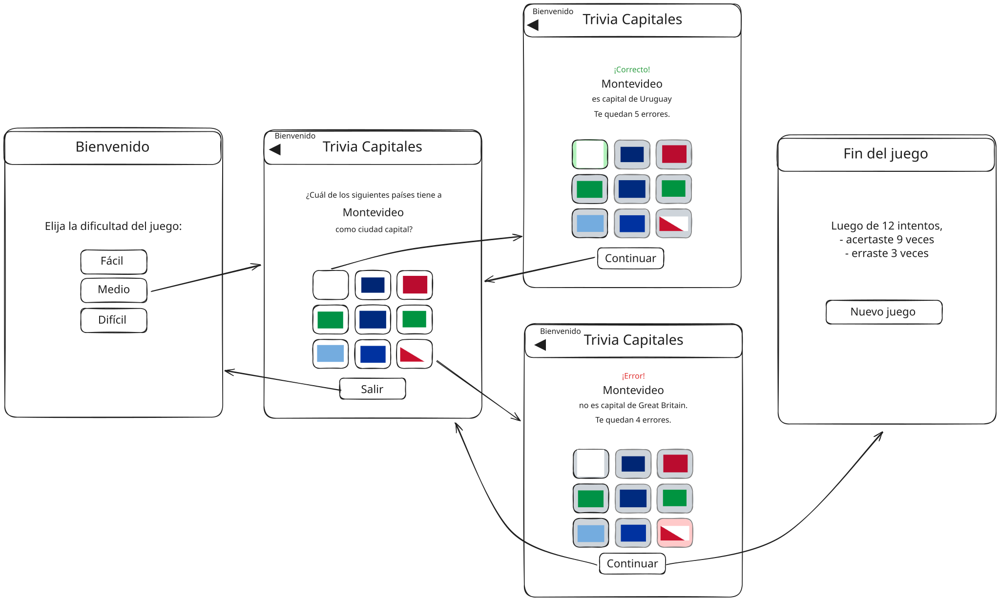

# Simulacro parcial 3 2026sem1

Simulacro del tercer parcial del curso de Desarrollo Web y Mobile.

## Inicialización

Crear un _fork_ privado de este repositorio. Clonar el _fork_ y ejecutar `npm i` en la raíz. La versión de desarrollo de la app se levanta haciendo `npm start` en la raíz. La plantilla del ejercicio provee un ruteador básico y dos vistas de ejemplo. Las carpetas `/app/api` y `/app/static` tienen datos y archivos para el _mock_ del _backend_ de la app, y **no** son de interés para realizar el ejercicio.

## Trivia de países

El ejercicio se trata de implementar una aplicación _mobile_ con React Native y Expo, para una trivia de países. Un croquis de interfaz de usuario pueden verse en la carpeta `/specs/design.svg`.



## Navegación

En proyecto contiene una navegación con Expo Router. Aunque la primera ruta sea index, no queremos que en el header de navegación diga header, si no que queremos que diga "Bienvenido". Se debe agregar al stack la pantalla de la trivia. Esta pantalla debe tener como titulo en el header de navegación "Trivia Capitales" con la posibilidad de ir a la pantalla anterior en la esquina izquierda.

Se deben tener las siguientes vistas.

### Vista 1: Bienvenida

En la ruta `/` se debe mostrar una bienvenida al usuario. Aquí se muestran 3 botones para comenzar una partida con tres diferentes niveles de dificultad:

- _Facil_ permite 8 errores.

- _Medio_ permite 5 errores.

- _Difícil_ permite 3 errores.

Cualquiera de los tres dirige a la ruta de juego.

### Vista 2: Juego

En la ruta `/game` se debe mostrar la capital de un país elegido al azar. Debajo de dicha capital, se deben mostrar nueve botones, cada uno con la bandera de un país. Una de esas banderas debe ser la del país cuya capital se está mostrando. Las otras ocho deben ser banderas de otros países elegidos al azar. Las posiciones de las banderas deben ser aleatorias.

Debajo de las banderas se muestran un botón, que puede ser:

- _Salir_, si no se respondió. Aborta el juego y vuelve a la vista de bienvenida.

- _Continuar_, si se contestó. Pasa a la siguiente jugada.

El usuario debe presionar el botón con la bandera del país correcto. Al hacerlo se debe:

- Indicarle al usuario si contestó bien o mal. El botón presionado debe colorearse con verde si se contestó bien, y rojo si contestó mal. Los otros botones deben colorearse con gris.

- Actualizar la cantida de errores disponibles del usuario y mostrárselo (si la respuesta fue un error).

### Ruta 3: Final

En la ruta `/end` se le muestra al usuario un resumen de la partida. Esto debe incluir cantidad de aciertos y errores.

## API e imágenes

La lista de todos los códigos de país disponibles se puede acceder haciendo:

```
GET /api/countries
200 ["ABW", "AFG", ...]
```

Se pueden obtener varios datos de un país en particular (incluyendo sus capitales) haciendo:

```
GET /api/countries/URY
200 {
  "name": {
    "common": "Uruguay",
    ...
  },
  "capital": ["Montevideo"],
  ...
}
```

Se pueden obtener países aleatorios de la siguiente forma:

```
GET /api/countries/random?n=2
200 ["URY", "ARG"]
```

dónde `n` es la cantidad de países deseada.

Las imágenes de las banderas de los países se pueden acceder en `/static/flags/cca3.svg` respectivamente, dónde `cca3` es el código de 3 letras del país (e.g. `URY`). Están disponibles en formatos SVG y PNG.

_Fin_